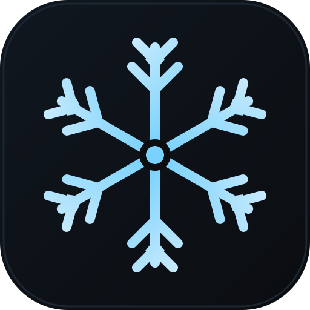
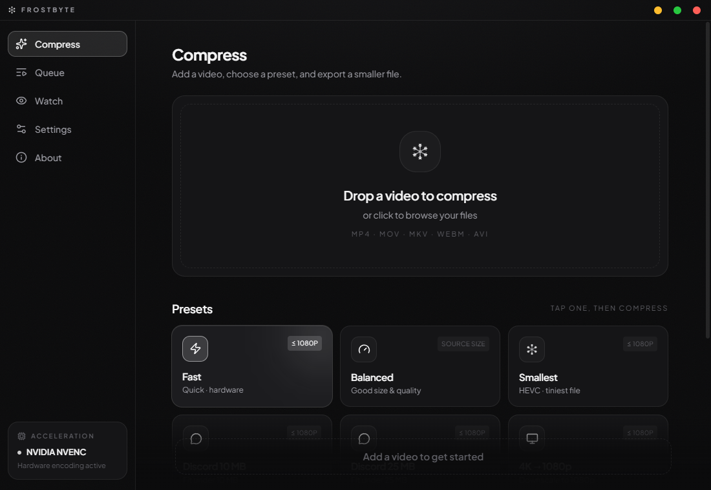
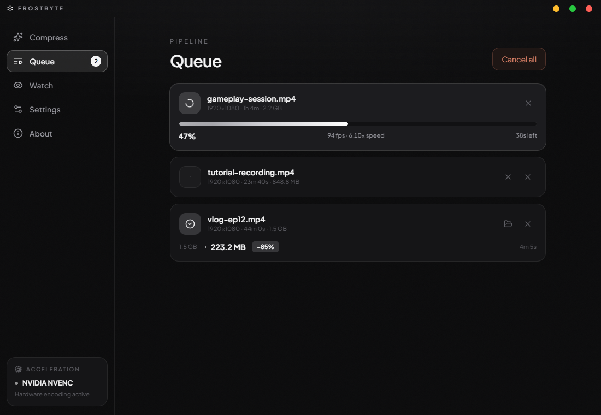
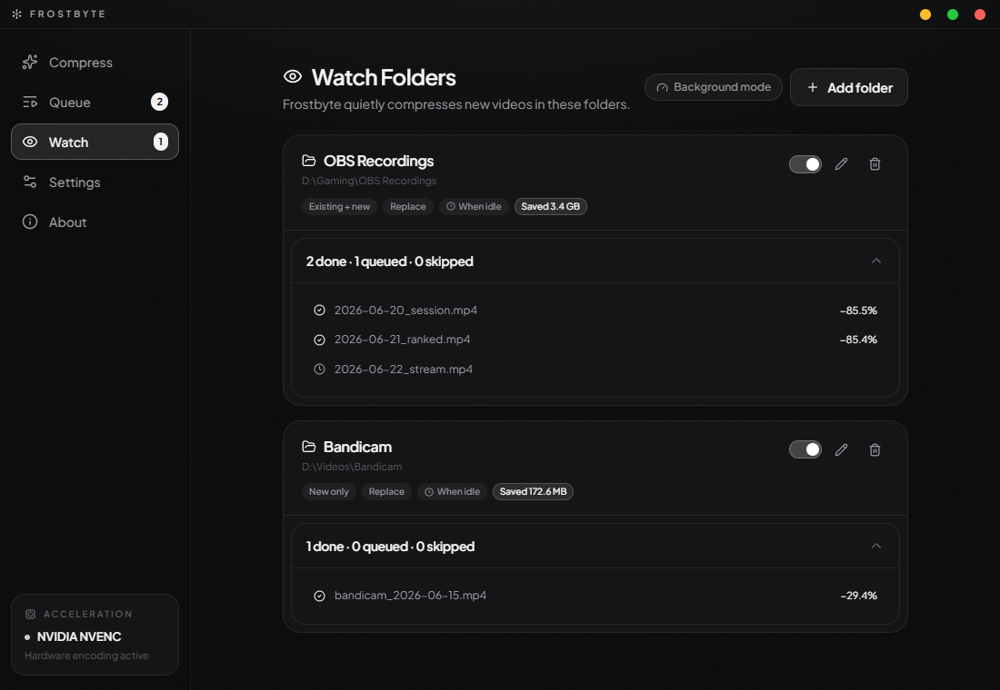
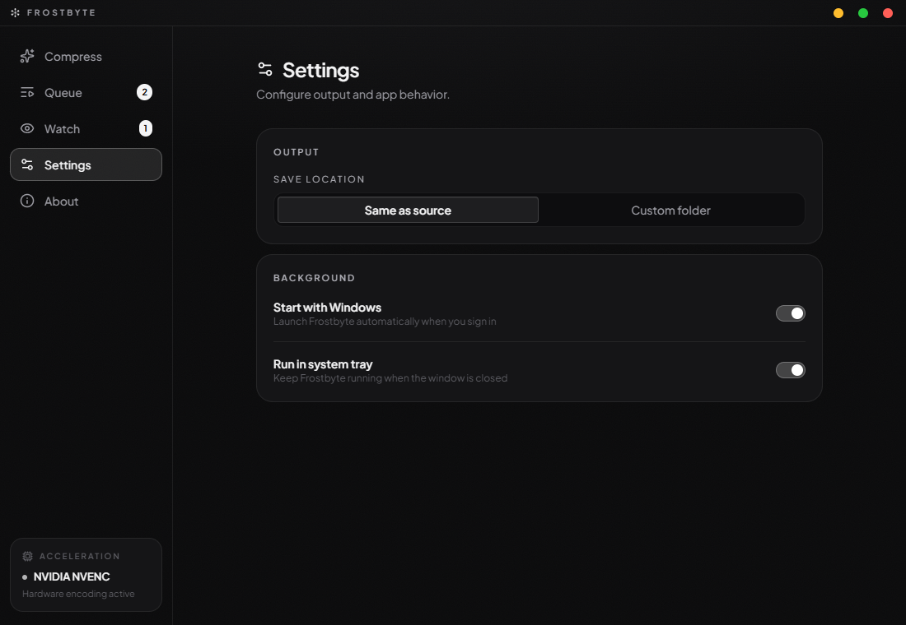
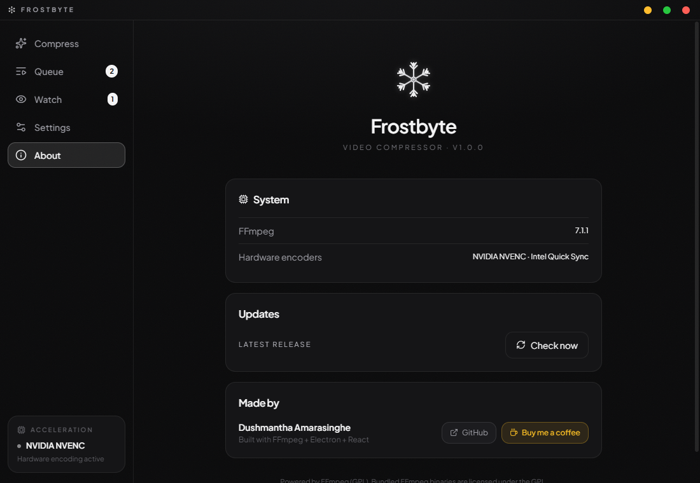

<p align="center">
  
</p>

<h1 align="center">Frostbyte</h1>

<p align="center">
  <strong>Hardware-accelerated video compression for Windows.</strong><br />
  Drop a video, pick a preset, get a smaller file — fast.
</p>

<p align="center">
  
  
  
  
  
</p>

<br />

<p align="center">
  
</p>

---

## What it does

Frostbyte wraps FFmpeg in a clean desktop UI built for Windows. It uses your GPU's hardware encoder to compress videos at 5–10× the speed of software, with no visible quality loss at typical settings.

- **Drop a video** → pick Fast, Balanced, or Smallest → done
- **Watch Folders** — point it at your OBS or Bandicam output folder and it quietly compresses everything while you're idle, saving disk space automatically
- **Queue** — batch multiple files; cancel or remove individual jobs at any time with live fps / speed / ETA
- **Hardware acceleration** — auto-detects NVIDIA NVENC, Intel Quick Sync, and AMD AMF; falls back gracefully to x264/x265 if none are found

---

## Screenshots

<table>
<tr>
<td align="center">
<br />
<sub><b>Queue</b> — active, waiting, and completed jobs in one view</sub>
</td>
<td align="center">
<br />
<sub><b>Watch Folders</b> — auto-compress on idle, track savings per file</sub>
</td>
</tr>
<tr>
<td align="center">
<br />
<sub><b>Settings</b> — output folder, filename template, startup & tray</sub>
</td>
<td align="center">
<br />
<sub><b>About</b> — version, detected hardware encoders, update check</sub>
</td>
</tr>
</table>

---

## Download

**[→ Download latest installer](https://github.com/Dushmantha-Amarasinghe/frostbyte-desktop/releases/latest)** — Windows, no admin required

Or build from source — see [Development](#development) below.

---

## Features

### Compress
One-click presets tuned for common use cases:

| Preset | What it does |
|--------|-------------|
| **Fast** | 1080p, hardware encoder, maximum speed |
| **Balanced** | Good size & quality balance |
| **Smallest** | Minimum file size (HEVC) |
| **Discord 10 MB** | Two-pass encode to stay under 10 MB |
| **Discord 25 MB** | Two-pass encode to stay under 25 MB |
| **4K → 1080p** | Downscale and re-encode |
| **Convert to MP4** | Fast container copy, no re-encode |
| **Web Optimized** | MP4 with faststart flag |
| **Audio Only** | Extract audio as MP3 |

### Watch Folders
Set it and forget it. Frostbyte monitors folders in the background:

- **Scope** — compress existing files, new files only, or both
- **Trigger** — when the system is idle, on a quiet-hours schedule, or immediately
- **Smart skip** — predicts savings before encoding; files that won't benefit are skipped so nothing is wasted
- **Output size validation** — results that end up larger than the original are automatically discarded
- **Pause / Resume** — freeze an in-progress encode mid-file without losing progress
- **Background mode** — lowers FFmpeg priority so games and GPU-heavy apps aren't affected

### System integration
- Starts with Windows automatically (written to HKCU — no admin rights needed)
- Lives in the system tray when the window is closed
- Custom frameless window with a dark frosted-glass UI
- FFmpeg bundled — no separate installation needed

---

## Development

### Prerequisites

- Node.js 20+
- Windows (hardware encoder detection is Windows-specific)
- FFmpeg GPL binaries in `resources/ffmpeg/`

### FFmpeg binaries

Download the `full_build` release from [gyan.dev](https://www.gyan.dev/ffmpeg/builds/). Extract `ffmpeg.exe` and `ffprobe.exe` into `resources/ffmpeg/`.

### Commands

```bash
npm install          # install dependencies
npm run dev          # start dev server (Electron + Vite HMR)
npm run build:win    # build NSIS installer → dist/Frostbyte-Setup-x.x.x.exe
npm run typecheck    # run TypeScript type checks
```

---

## Stack

| | Technology |
|--|-----------|
| Shell | Electron 39 |
| Renderer | React 19 + TypeScript + Tailwind 3.4 |
| Bundler | electron-vite |
| State | Zustand |
| Animations | Framer Motion |
| Database | better-sqlite3 (Watch Folders ledger) |
| Video engine | FFmpeg GPL (bundled) |
| Packaging | electron-builder (NSIS) |

---

## License

MIT — free to use, modify, and distribute.

Bundled FFmpeg binaries are licensed under the **GPL v2+**. See [ffmpeg.org/legal](https://ffmpeg.org/legal.html).

---

<p align="center">
  Made by <a href="https://github.com/Dushmantha-Amarasinghe">Dushmantha Amarasinghe</a>
  &nbsp;·&nbsp;
  <a href="https://www.paypal.com/donate?business=dsbamarasinghe1234@gmail.com&currency_code=USD&amount=5">Buy me a coffee ☕</a>
</p>
